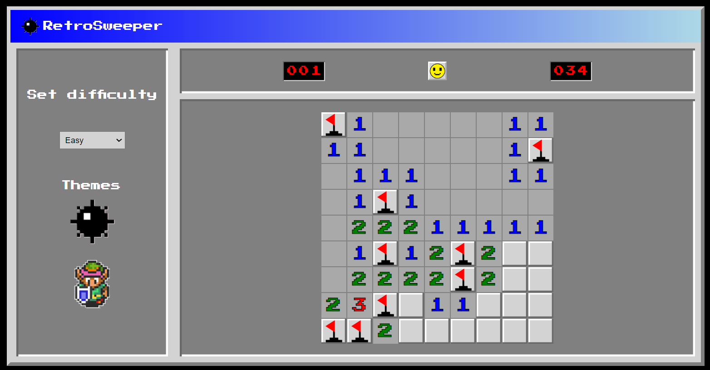

# RetroSweeper

This is a recreation of the classic Windows 98 version of MineSweeper with an additional
retro theme: A link to the Past.

## Game Play
- The goal of the game is to clear all the tiles on the board that do not contain a mine.
- When a tile is left clicked, it will reveal the space below. The space below can contain a mine, a number, or nothing.
  - If a mine is revealed, the player loses.
  - If a number is revealed, that number symbolizes how many adjacent tiles contains a mine (numbers range from 1-8).
  - If nothing is revealed, this tile is empty and is not adjacent to any mines. When a tile is empty, it will clear all adjacent tiles until the tiles show a number.
- When tiles are right clicked, a flag is placed and the tile cannot be revealed. When right clicked again, the flag is removed and the tile can be revealed.
- Players can toggle the difficulty through the drop down menu on the left
- Players can toggle the theme by clicking on one of the theme icons

## [Play RetroSweeper Here](https://michellelinares-minesweeper.netlify.app/) 🎮
## [Planning materials](https://docs.google.com/document/d/1gpfvfx2IHLGcGZ3drg1CmWVeihv6vaf5uGW5AC-dkVk/edit) 🗒
## Technologies used 🖥
- CSS
- JavaScript
- HTML
- Git
## Attributions 📣

**Font** RetroSweeper uses [Press Start 2P](https://fonts.google.com/specimen/Press+Start+2P) designed by CodeMan38 as the main font. Sourced from [fonts.google.com](https://fonts.google.com/).

**Confetti** RetroSweeper uses confetti.js provided by Ben Manely through GA.

**Sound assets** 
RetroSweeper uses a number of sound assets found on [freesound.org](https://freesound.org/). Sounds include the following: 
- S: [Button Click.wav](https://freesound.org/people/KorgMS2000B/sounds/54405/) by KorgMS2000B | License: Creative Commons 0
- S: [Error_03.wav](https://freesound.org/people/distillerystudio/sounds/327736/) by distillerystudio | License: Attribution 3.0
- S: [Correct Choice](https://freesound.org/people/unadamlar/sounds/476178/) by unadamlar | License: Creative Commons 0
- S: [OKAY!](https://freesound.org/people/Scrampunk/sounds/345299/) by Scrampunk | License: Attribution 4.0
- S: [Cancel/miss chime](https://freesound.org/people/Raclure/sounds/405548/) by Raclure | License: Creative Commons 0

**Image assets** RetroSweeper uses image assets drawn by myself personally. **However all Image assets were inspired by:**
- Legend of Zelda A Link to the Past (A property of Nintendo)
- Windows 98 MineSweeper

## Ice Box 🧊
- [x] Fix Flag Display
- [x] Add revealed tile Image
- [x] No Mines on/adjacent to first click of the game
- [x] Add Confetti
- [x] Switch difficulties (Easy, Medium, Hard)
- [x] Switch Themes (Retro MineSweeper, A Link to the Past)
- [x] Add Timer
- [ ] Add a Space Invaders Theme
- [x] Add Sound
- [ ] Add Best Time Tracker
- [ ] Add Leaderboard
- [ ] Show all Mines when loose